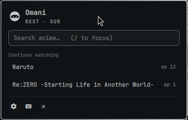

# Omani

Watch anime from the Omarchy bar. Search, resume what you are part-way through,
and follow a series without leaving the panel — all keyboard-driven, with vim
motions. Inspired by [ani-cli](https://github.com/pystardust/ani-cli).



## Install

```bash
omarchy plugin add https://github.com/fihuza/omani.git --enable
```

Omani needs `mpv`, `curl` and `jq`. If anything is missing the panel names it
rather than failing silently.

## Usage

| Action | How |
|---|---|
| Open the panel | Left-click the icon |
| Resume the top series | **Right-click** the icon — no panel needed |
| Search | Type in the field, or press `/` |
| Play a series | Click its row, or select it and press Enter |
| Control what is playing | Pick it under **Playing** |
| Settings | The 󰜓 button, or press `s` |

### Keyboard

The panel is fully keyboard-driven, and every view — the watch history, search
results, the episode list, the player menu and the settings — is the same list
moving under the same keys.

| Key | Action |
|---|---|
| `j` / `k` | Next / previous row |
| `3j`, `12k` | Repeat a motion *n* times |
| `gg` / `G` | First / last row |
| `4G`, `4gg` | Jump to row 4 |
| `Ctrl-d` / `Ctrl-u` | Half a page down / up |
| `/` or `i` | Focus the search field |
| `Enter` | Open or play the row under the cursor |
| `s` | Settings — quality and subbed/dubbed |
| `?` | Keyboard shortcuts |
| `r` | Re-read status and history |
| `x` | Clear watch history (asks first) |
| `Esc` | Back, then close |
| `q` | Close the panel |

A half-typed count shows in the panel's bottom-right, the way vim shows a
partial command. While the search field has focus every key goes to the field,
so typing `hjkl` types text — `Esc` returns you to the list.

## Playing

Choosing a series from **Continue watching** starts a player and opens its menu:

```
Next episode · Replay · Previous episode · Select episode · Change quality · Stop
```

Those choices **replace** the episode they were opened for, so following a
series never leaves a trail of players behind. Starting something from the
watch history is what adds one, so two series can run side by side — each
listed under **Playing**, each with its own menu.

A player counts as live only while Omani started it *and* it is still on the
bus, so a video you started yourself is never listed and never stopped.

## Configure

Settings live in the widget's entry in `~/.config/omarchy/shell.json` and are
editable from the panel. All of them hot-reload.

| Setting | Default | Meaning |
|---|---|---|
| `historyLimit` | `8` | How many series to list (1–20) |
| `quality` | `best` | `best`, `1080`, `720`, `480`, `360`, `worst` |
| `mode` | `sub` | `sub` or `dub` |
| `showNowPlaying` | `true` | Show the playing title beside the bar icon |

## How it works

Omani talks to the provider itself: searching, listing episodes, resolving a
stream and starting the player all happen here, so results render in the panel
and no terminal window is ever involved.

`bin/omani-provider` is derived from [ani-cli](https://github.com/pystardust/ani-cli)
— see [NOTICE](NOTICE) — but ani-cli is not a dependency. Fetching and parsing
are separate subcommands, so the parsers are driven from saved pages in tests
and reach no network.

Resuming asks the provider which episode follows the one in your history rather
than adding one, so numbering that skips or carries decimals is handled by the
real list.

## Dependencies

Omani runs unsandboxed inside the shared Omarchy shell process, so every
external command it can invoke is listed here.

| Command | Used for | Required |
|---|---|---|
| `mpv` | playback | yes |
| `curl` | talking to the provider | yes |
| `jq` | status and manifest reading | yes |
| `omarchy-notification-send` | "now playing" notification | yes (ships with Omarchy) |
| `awk`, `sed`, `base64`, `od`, `mktemp` | parsing, history, deobfuscation | yes (base system) |

`curl-impersonate` is used when present, which gets past Cloudflare where plain
`curl` is blocked.

No privileged commands, no services, no installers. Omani writes only to
ani-cli's history file format (and a `.omani.bak` beside it) and a record of the
players it started.

## Remove

```bash
omarchy plugin remove io.github.fihuza.omani
```

Your watch history is left alone.

## Development

```bash
git config core.hooksPath scripts   # after cloning
./scripts/pre-commit                # every gate CI runs
./scripts/pre-commit qml-lint       # or just one of them
```

`scripts/pre-commit` is the whole quality gate: `qmlformat` and `qmllint` for
the QML, `shellcheck` and `shfmt` for the shell, `omarchy plugin validate` for
the manifest, and the three test suites with a 90% coverage floor on `Model.js`.

The layers are kept apart on purpose:

| | |
|---|---|
| `Model.js` | pure functions — parsing, the key reducer, view decisions. Tested with `node --test`. |
| `*.qml` | presentation and wiring only; no branching logic |
| `bin/omani` | every external command, env var and fallback |
| `bin/omani-provider` | the provider; fetching and parsing split so parsers test offline |

The tests reach no network and start no real player, so they pass on a machine
with no `mpv`, no `curl` and no Omarchy installed. CI runs `./scripts/pre-commit`
itself, so the hook and the pipeline cannot drift apart.

## License

GPL-3.0-or-later — see [LICENSE](LICENSE).

Omani's provider layer is derived from
[ani-cli](https://github.com/pystardust/ani-cli), which is GPL-3.0-or-later, so
this plugin carries the same license. See [NOTICE](NOTICE) for what is derived
and from where.
