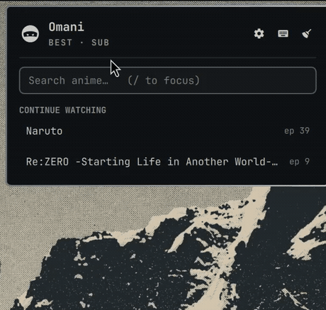
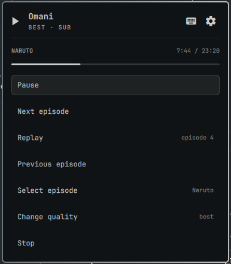

# Omani

Watch anime from the Omarchy bar. Search, resume what you are part-way through,
and follow a series without leaving the panel — all keyboard-driven, with vim
motions. Inspired by [ani-cli](https://github.com/pystardust/ani-cli).



## Install

```bash
omarchy plugin add https://github.com/fihuza/omani.git --enable
```

Nothing else to install: Omani's dependencies all ship with Omarchy.

## Usage

| Action | How |
|---|---|
| Open the panel | Left-click the icon |
| Resume the top series | **Right-click** the icon — no panel needed |
| Search | Type in the field, or press `/` |
| Play a series | Click its row, or select it and press Enter |
| Control what is playing | Pick it under **Playing** — pause, follow the series, change quality, stop |
| Forget a series | Hover its row and click ✕, or select it and press `d` or `x` |
| Settings | The gear button in the header, or press `s` |
| Clear the watch history | **Settings → Clear watch history**, or press `c` |
| Open this repository | Press Enter on **Version** in the settings |

### Keyboard

The panel is fully keyboard-driven, and every view — the watch history, search
results, the episode list, the player menu and the settings — is the same list
moving under the same keys.

| Key | Action |
|---|---|
| `j` / `k` | Next / previous row |
| `3j`, `12k` | Repeat a motion *n* times |
| `gg` / `G` | First / last row |
| `4G`, `4gg` | Jump to row 4 |
| `Ctrl-d` / `Ctrl-u` | Half a page down / up |
| `/` or `i` | Focus the search field |
| `Enter` | Open or play the row under the cursor |
| `s` | Settings — quality, audio, watched threshold, clear history |
| `?` | Keyboard shortcuts |
| `d` or `x` | Forget the series under the cursor |
| `c` | Clear the whole watch history (asks first) |
| `r` | Re-read status and history |
| `Esc` | Back, then close |
| `q` | Close the panel |

A half-typed count shows in the panel's bottom-right, the way vim shows a
partial command. While the search field has focus every key goes to the field,
so typing `hjkl` types text — `Esc` returns you to the list.

## Playing

Choosing a series from **Continue watching** starts the episode you are on, at
the second you stopped, and opens its menu:



The menu carries a bar for the episode it controls: how far in it is, and
dimmed while it is paused.

**Next episode** and **Previous episode** move through the series whatever is
left of the episode you are on: the one you leave keeps the progress it had
rather than counting as watched, and the one you land on picks up where you
left it unless you watched it to the end.

**One player per series.** Starting any episode of a series closes whatever
else of that series is running, however you got there — the menu, the episode
list, or the bar icon — so following a series never leaves a trail of players
behind. A different series adds a second player, so two can run side by side,
each listed under **Playing** with its own menu.

**Select episode** picks the chosen episode up where you left it, and so does
changing quality; **Replay** is the one control that starts an episode over.

**Change quality** applies to the episode playing, not to the setting, and is
offered only when the provider has more than one variant of it. The next
episode starts at the `quality` setting again.

A player counts as live only while Omani started it *and* it is still on the
bus, so a video you started yourself is never listed and never stopped.

## Configure

Settings live in the widget's entry in `~/.config/omarchy/shell.json` and are
editable from the panel. All of them hot-reload.

| Setting | Default | Meaning |
|---|---|---|
| `historyLimit` | `8` | How many series to list (1–20) |
| `quality` | `best` | `best`, `1080`, `720`, `480`, `360`, `worst` |
| `mode` | `sub` | `sub` or `dub` |
| `watched` | `90` | how far into an episode counts as finished (percent) |

## How it works

Omani talks to the provider itself: searching, listing episodes, resolving a
stream and starting the player all happen here, so results render in the panel
and no terminal window is ever involved.

`bin/omani-provider` is derived from [ani-cli](https://github.com/pystardust/ani-cli)
— see [NOTICE](NOTICE) — but ani-cli is not a dependency. Fetching and parsing
are separate subcommands, so the parsers are driven from saved pages in tests
and reach no network.

Omani keeps its own watch history: which episode of a series you are on, how
far into it you are, how long it runs, and every episode you have finished. It
samples the player's position every few seconds while it runs, so continuing a
series picks the episode up where you stopped rather than at the beginning. Only an episode
watched past the `watched` percentage counts as finished; continuing then moves
to the next one, which the provider's episode list decides — so numbering that skips
or carries decimals is handled by the real list rather than by adding one.

A series you are done with is dropped with `d` or `x`, the key every Omarchy
panel uses to remove the row under the cursor. `c` clears the history entirely,
and asks first.

## Dependencies

Omani runs unsandboxed inside the shared Omarchy shell process, so every
external command it can invoke is listed here.

| Command | Used for | Comes from |
|---|---|---|
| `mpv` | playback | Omarchy's base packages |
| `jq` | the watch history, the embed payload, status | Omarchy's base packages |
| `curl` | talking to the provider | a dependency of `pacman`, so always present |
| `awk`, `sed`, `base64`, `od`, `mktemp` | parsing, history, deobfuscation | base system |
| `flock` | serialising writes to the watch history | `util-linux`, required by `base` |
| `omarchy-launch-browser` | opening this repository from the settings | Omarchy |

**On Omarchy there is nothing to install.** Every one of these is already
there, and `mpv-mpris` is too. That last one is not a command Omani runs — it
is a script mpv loads, and without it mpv does not report what it is playing.
Search and playback still work; what stops is tracking, so nothing appears
under **Playing** and the player menu has nothing to control. The panel says
so rather than leaving you to guess.

`curl-impersonate` is used when present, which gets past Cloudflare where plain
`curl` is blocked.

What the provider answers is checked before it reaches the player: a stream or
a subtitle that is not an http address is refused rather than passed on, and
the player is told where its arguments end, so nothing the site returns can
become an option or a local path. The same holds for what the provider makes
Omani *fetch*: the embed address it hands back is checked the same way, and
`curl` is confined to http and https on the request and on any redirect, so a
compromised provider cannot point it at a local file. What you type is
percent-encoded, so a title carrying `&` or `#` is searched for as written.

No privileged commands, no services, no installers. Omani writes only its own
watch history under `$XDG_STATE_HOME/omani` (with a `.bak` and a lock file
beside it) and a record of the players it started, under `$XDG_RUNTIME_DIR`. A player is only
ever listed or stopped while its pid still belongs to the process the record
named.

## Remove

```bash
omarchy plugin remove io.github.fihuza.omani
```

Your watch history is left alone.

## Development

```bash
git config core.hooksPath scripts   # after cloning
./scripts/pre-commit                # every gate CI runs
./scripts/pre-commit qml-lint       # or just one of them
```

`scripts/pre-commit` is the whole quality gate: `qmlformat` and `qmllint` for
the QML, `shellcheck` and `shfmt` for the shell, `omarchy plugin validate` for
the manifest, and the four test suites with a 90% coverage floor on `Model.js`.

The layers are kept apart on purpose:

| Layer | Responsibility |
|---|---|
| `Model.js` | pure functions — parsing, the key reducer, view decisions. Tested with `node --test`. |
| `*.qml` | presentation and wiring only; no branching logic |
| `bin/omani` | every external command, env var and fallback |
| `bin/omani-provider` | the provider; fetching and parsing split so parsers test offline |

The tests reach no network and start no real player, so they pass on a machine
with no `mpv`, no `curl` and no Omarchy installed. CI runs the gates from
`./scripts/pre-commit` itself, and a test holds the two to each other, so a gate
cannot be renamed, dropped or mistyped into a pipeline step that checks nothing.

## License

GPL-3.0-or-later — see [LICENSE](LICENSE).

Omani's provider layer is derived from
[ani-cli](https://github.com/pystardust/ani-cli), which is GPL-3.0-or-later, so
this plugin carries the same license. See [NOTICE](NOTICE) for what is derived
and from where.
